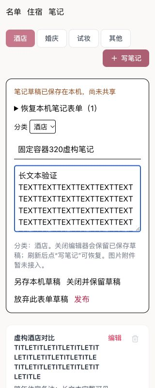

# S01 名单、住宿、笔记响应式验收

日期：2026-10-07。独立工作树：`/Users/baojie/.codex/worktrees/c888/wedding-planner`。
共同基线：`67da3c3759116edd34535782d7fa950ff52a738f`，启动时 HEAD 一致且工作树干净。未修改 `/Users/baojie/dev/wedding-planner` 主 checkout；仅链接其 `node_modules`，未复制配置或凭证。未 push/deploy。

## 环境与复现

运行 `node scripts/fusion/review-sol-s01-responsive.mjs`，访问 `http://127.0.0.1:4190/__sol_s01`。夹具复用实际三个页面、`PageStoreContext`、`RepositoryContext`、`createPageStore`、repository、真实 IndexedDB 表单/命令存储。transport 只操作本地内存虚构 snapshot/receipt，使用现有 `projectDraft`；不接 CloudBase、不接真实项目。刷新会重置虚构共享安排；本机未提交表单仍按实际编辑器逻辑保留。它不是持久服务或云端验收入口。

夹具使用与主流程一致的 `h-dvh` / `flex-1 overflow-hidden min-h-0 min-w-0` 页面容器；上方只保留三页切换按钮，未复刻项目标题、链接管理、全局草稿/导出弹层。虚构样本含长姓名、连续英文长分组/桌名/房号、前导零电话、2026-12-31→2027-01-02 晚次和连续长 URL 笔记。初始 3 位宾客、1 间标间、1 篇文本笔记；操作回归另外新增宾客/房间/笔记。

使用本任务创建的独立 Codex In-app Browser 标签页，不操作主会话标签。浏览器 viewport 调整有异步刷新，验收以页面 `innerWidth` 回读为准；最终截图均在实际 CSS 320/390/768/1280 px 下采集。退出前清除 viewport override。此项是桌面 Chromium 视口模拟，不是手机/微信真机触摸验收。

## 发现与最小修复

- 名单：长分组的原生 select 超宽，筛选按钮/同行姓名与房间徽章超出容器；四列统计在窄屏逐字挤压。限制页面内表单控件宽度，筛选和信息换行，窄屏两列统计，编辑/删除按钮在窄屏直接可见。
- 名单与笔记：固定高度容器下，上部控件可能挤掉列表空间。窄屏整页纵向滚动，`sm` 起保留原 flex 列表滚动布局。
- 住宿：操作栏不换行，宾客选择弹窗长房号挤出关闭按钮，姓名截断，搜索框可能超宽。操作栏换行，弹窗标题/姓名换行，关闭按钮不收缩且加可访问名称，搜索 input 可收缩；容量与添加按钮换行。
- 住宿日期弹层：原本相对“添加日期”按钮向右展开，窄屏会越界。窄屏居中固定弹层，桌面仍锚定按钮；统计姓名提示也约束窄屏位置/长文本。
- 笔记：分类栏不可换行，连续长标题与正文在内部滚动区超宽。分类栏换行、编辑按钮不收缩，标题/正文允许连续文本断行，窄屏删除入口直接可见。

只修改三个获准页面的布局/可访问名称，未修改 `src/fusion`、server、类型契约、依赖、CI 或汇总文档。

## 已执行检查

最终固定高度容器下，读取 document 宽度，并检查页面内 div/section/h3/p 的 `scrollWidth > clientWidth + 2`，排除用户输入本身正常的单行横向文本滚动。结果如下：

| 实际 CSS 宽度 | 名单 document 宽度 / 内部超宽 | 住宿 | 笔记 |
| --- | --- | --- | --- |
| 320 | 320 / 0 | 320 / 0 | 320 / 0 |
| 390 | 390 / 0 | 390 / 0 | 390 / 0 |
| 768 | 768 / 0 | 768 / 0 | 768 / 0 |
| 1280 | 1280 / 0 | 1280 / 0 | 1280 / 0 |

实际操作与回读：

- 320 px：新增虚构宾客，长分组选择、电话输入，名单人数 3→4；编辑原宾客电话回读 `000987654321`；新增自定义类别回读；打开不出席确认并取消。固定容器下重新滚动到长姓名、打开确认并取消，确认区域无横向溢出。
- 320 px：日历选 10 月 31 日，日期筛选出现 `10.31`；弹窗搜索“虚构宾客1”、安排住宿、关闭成功；手选 2027-01-01，及原宾客 2027-01-02，`aria-pressed` 和单晚峰值回读一致。固定容器下重新验证日历、关闭按钮与 1.2 晚次。
- 320 px：长正文输入、发布虚构笔记、标题修改后保存；固定容器下重新发布 `固定容器320虚构笔记`，编辑器关闭且列表出现标题/完整正文。
- 390 px：固定容器下将标题修改为 `固定容器390虚构修改` 并保存；选择弹窗搜索/分配宾客1、关闭，手选 2027-01-01 回读 pressed；三页截图及内部宽度检查通过。
- 768 px：笔记输入并关闭保留草稿；新增大床房、标间，房号改为 `S01虚构长房号768ABCDEFGHIJKLMNOPQRSTUVWXYZ` 并保存，三页布局及宽度检查通过。
- 1280 px：三页布局回归，名单四列统计、笔记分类/编辑操作、三间房卡片与晚次可见，无内部横向溢出。

静态检查通过：

```sh
node_modules/.bin/tsc -p tsconfig.app.json --tsBuildInfoFile /private/tmp/sol-s01-app.tsbuildinfo
node_modules/.bin/tsc -p tsconfig.node.json --tsBuildInfoFile /private/tmp/sol-s01-node.tsbuildinfo
node_modules/.bin/oxlint src/pages/GuestsPage.tsx src/pages/AccommodationPage.tsx src/pages/NotesPage.tsx scripts/fusion/review-sol-s01-responsive.mjs
node --check scripts/fusion/review-sol-s01-responsive.mjs
git diff --check
```

`tsc -b` 最初因依赖链接下 `.tmp` 无写权限而失败；改为本任务 `/private/tmp` build-info 后通过，没有改主 checkout。夹具显式使用 `configFile:false` 与现有 React/Tailwind 插件，避免向链接依赖目录写 `.vite-temp`。本任务未重复全量 `npm run check`，由主会话集成后执行。

## 截图

同前缀 JPEG 为最终固定高度容器的截图，`guests/rooms/notes-{320,390,768,1280}` 为各页面主要区域；320 下另有长姓名列表、确认、日历、分房弹窗、晚次及笔记编辑器。




## 限制与主会话下一步

没有发现必须越界修改共享编辑器的阻断缺陷。单行房号/姓名输入按原生输入规则滚动查看长值，列表和弹窗正文均可换行。此次仅验证页面与本地数据；完整 FusionLayout 全局导航/弹层、真实云端、独立身份、真机触摸/软键盘/切后台、旧版图片上传流程及正式发布仍未验收。分房弹窗长数据纵向滚动与实际按钮操作已验证，不把浏览器鼠标点击当真机触摸证明。
